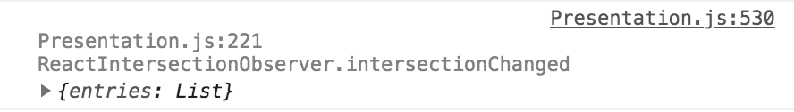
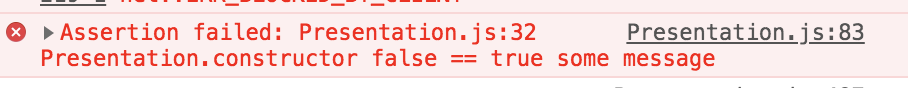

# @zemnmez/macros
```bash
yarn add @zemnmez/macros
```

this repo contains some babel macros i find useful

## @zemnmez/macros/log.macro

```javascript
import log from '@zemnnmez/macros/log.macro';
const [x, y] = ["hello", "world"];
log({ x, y });
```

This macro produces no code unless `NODE_ENV == development`. It exposes a macro, `log()`, intended to be used like a function.

When `NODE_ENV != development`, the macro is functionally almost identical to `console.log`, except the file, line,
class and method that the log was called from is prepended in light grey.

## @zemnmez/macros/assert.macro

```javascript
import assert from '@zemnmez/macros/assert.macro';
const [x, y] = [true, false];
asset(x == y, {x, y});
assert(true == false, "some message", "some other message");
```

This macro produces no code unless `NODE_ENV == development`. It exposes a macro, `assert()`, indended to be used like a function.

When `NODE_ENV != development`, this macro is functionally almost identical to `console.assert`, except the file,
line, class, class method and the raw code of the assertion are all printed when it fails.
